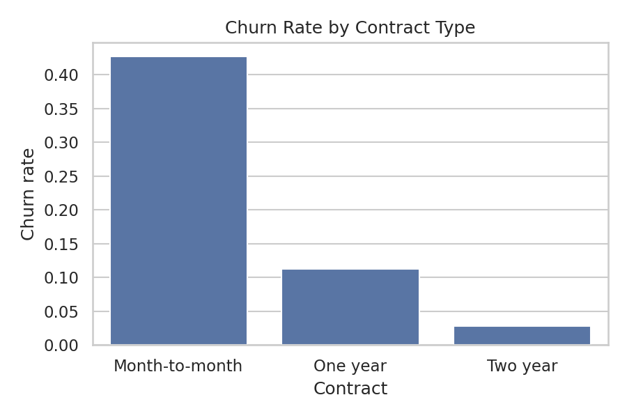
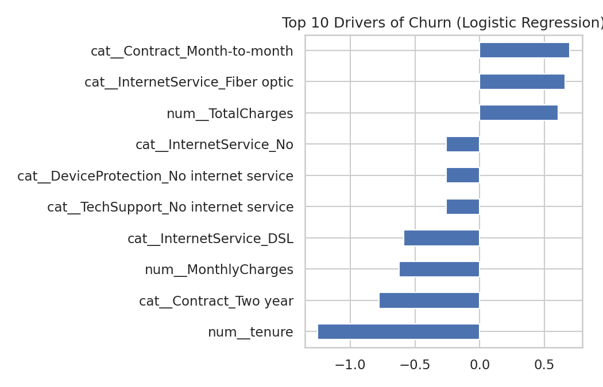
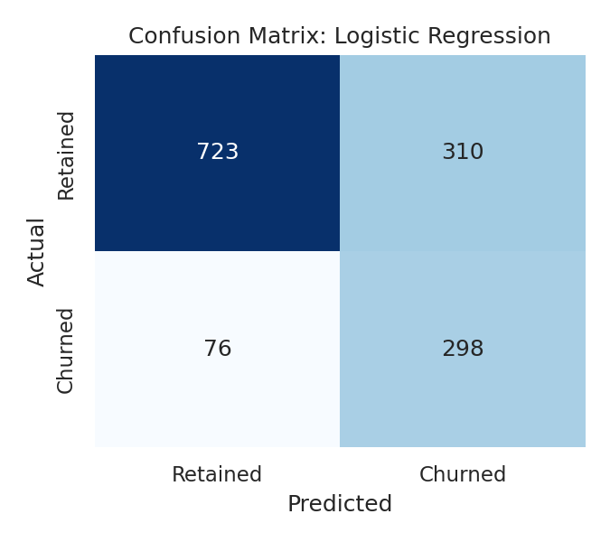

# Customer Churn Analysis: SQL + Machine Learning

Analyzing why telecom customers leave, and predicting who is likely to leave next.

## Problem
Acquiring a new customer costs far more than keeping an existing one. This project
finds which customer groups churn most (using SQL) and builds a model that flags
at-risk customers (using Scikit-learn).

## Dataset
Telco Customer Churn (IBM sample data, Kaggle): 7,043 customers, 20 features
(contract type, tenure, services, billing, monthly charges) and a Churn label.
Link: https://www.kaggle.com/datasets/blastchar/telco-customer-churn

## Tools
Python, Pandas, NumPy, SQL (SQLite), Matplotlib, Seaborn, Scikit-learn

## Approach
1. **Data cleaning:** converted `TotalCharges` to numeric, removed rows with missing values and duplicates.
2. **SQL analysis:** churn rate by contract, tenure bucket, and payment method; revenue at risk.
3. **EDA and visualization:** churn patterns by contract, tenure, and monthly charges.
4. **Modeling:** Logistic Regression vs Random Forest with a preprocessing pipeline
   (scaling + one-hot encoding), 5-fold stratified cross-validation, class weighting for imbalance.
5. **Evaluation:** Accuracy, Precision, Recall, F1, ROC-AUC on a held-out 20% test set.

## Key Findings
- Overall churn rate: **26.6%** (1,869 of 7,032 customers after cleaning)
- **Contract type is the strongest signal:** month-to-month customers churn at **42.7%**, versus **11.3%** (one-year) and **2.8%** (two-year)
- **New customers are most at risk:** customers in their first 12 months churn at **47.7%**, versus **9.5%** for those with 49+ months of tenure
- **Fiber optic + electronic check** is the riskiest segment at **53.2%** churn (1,595 customers)
- Churned customers pay more per month (avg **$74.44** vs **$61.31**) and leave much sooner (avg tenure **18.0** vs **37.7** months)
- Month-to-month customers account for about **87%** of the monthly revenue lost to churn (~$120.8K of ~$139.1K)
- **Best model: Logistic Regression** (test set): Recall **0.80**, Precision **0.49**, F1 **0.61**, ROC-AUC **0.84**, Accuracy **0.73**
- Random Forest scored higher accuracy (0.78) but caught far fewer churners (recall 0.48), so Logistic Regression was chosen because missing a churner costs more than a false alarm
- Top drivers: short tenure, month-to-month contract, and fiber optic internet increase churn risk; longer contracts reduce it

## Results




## Business Recommendations
- Offer discounts or perks to move month-to-month customers onto one- or two-year contracts.
- Add onboarding and check-in support during the first 12 months, when churn is highest.
- Investigate the fiber optic + electronic check group (service quality, pricing, billing friction) and encourage automatic payment methods.
- Use the model's churn probabilities to prioritize retention outreach; it catches about 80% of churners at the cost of some false alarms.

## Limitations
- The dataset is a single snapshot of one company's customers, so results may not generalize.
- Precision is moderate (0.49): about half of flagged customers would not actually have churned. The decision threshold can be tuned to the business's cost of outreach.
- Tenure, MonthlyCharges, and TotalCharges are correlated, so individual coefficients should not be over-interpreted.

## Possible Improvements
Hyperparameter tuning, Gradient Boosting/XGBoost, threshold tuning, SHAP explanations, and a Streamlit app for scoring customers.

## How to Run
```bash
pip install -r requirements.txt
# download the dataset CSV into this folder, then:
python churn_analysis.py
```
Outputs (charts, SQL results, model metrics) are saved to the `outputs/` folder.

## Author
Gayathri Bhargavi | [LinkedIn](https://www.linkedin.com/in/gayathri-bhargavi) | [GitHub](https://github.com/Gayathribhargavi)
